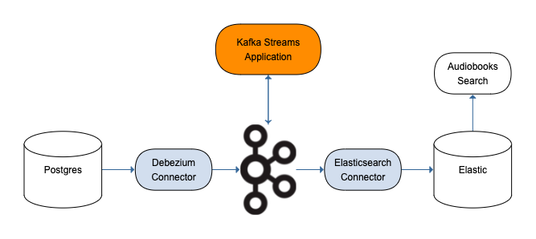

Kafka Streams Workshop
======================


## Before we start

We highly recommend to run the ``./install.sh`` script before attending
the workshop! This will download all docker images, and maven dependencies
needed, and will allow you to get started quickly on the exercises.

### Requirements

You will need ``docker`` and `docker-compose` to run containers. Make sure that
Docker has enough memory available, minimum 6G.

### Add ``dockerhost`` to `/etc/hosts`

This tutorial will refer to ``dockerhost`` as the hostname of your docker VM. It might be a good idea to alias it in
your ``/etc/hosts``
file. If you are on Linux, or use Docker for Mac and use localhost, then simply add:

```
127.0.0.1 dockerhost
```

## What we will build



This figure gives a broad overview of the components that we will play with
in this workshop. One of them, the _Kafka Streams Application_ will be our main
focus, but you will also learn how to move data to and from Kafka with the help
of Kafka Connect.

|  | As you complete the exercises, the audiobook-search application will improve with each step. Most of the content will come from database tables, but also from _user like_ events generated by a different microservice.  |
| ------------- | ------------- |


## Exercise 1

In this first exercise we will learn how to use _Kafka Connect_ with the _Debezium_ plugin to pull data from Postgres
into Kafka topics. Once data is available in Kafka topics, we will implement a simple transformation with
_Kafka Streams_, and use another Kafka Connect plugin to load the data into _Elasticsearch_.

### Inspect database tables

Start up postgres service:

    docker-compose up -d db

In a separate terminal window, run _psql_. Please keep this terminal, as you will later use it to make changes to your
data.

    docker-compose exec db psql -U admin -d audiobooks

Books and authors are available under the schema ``inventory``:

    set search_path to inventory;
    select b.isbn, b.title, a.name as author from book b join author a on a.id=b.author_id limit 10;

Books used in this workshop are based on the dataset found [here](https://www.kaggle.com/dylanjcastillo/7k-books-with-metadata)

### Kafka Connect and the Debezium plugin

Now on to the fun part. We will create a program that pulls data from our database to make it available in Kafka
topics, and what better way than to use the Postgres transaction log as the source! If this task seems daunting, you
will be happy to know that [Debezium](https://debezium.io/documentation/reference/stable/connectors/postgresql.html)
provides all of that for us. FYI, this process is sometimes referred to as _Change Data Capture_.

But first, let's start up _Kafka Connect_ (with the Debezium plugin installed), and _Kafdrop_ - a GUI to allow us to
easily see the content of our topics.

    docker-compose up -d kafka-connect kafdrop

Open [Kafdrop](http://dockerhost:9000/) to see what topics are created.

Now, register the debezium connector:

    curl -X POST -H 'Content-Type: application/json' -d @./kafka-connect/debezium-source-inventory.json http://dockerhost:8085/connectors

Check the status of the connector:

    curl http://dockerhost:8085/connectors/debezium-source-inventory/status

Both connector state, and task state should be `RUNNING`:

```
{
  "name": "debezium-source-inventory",
  "connector": {
    "state": "RUNNING",
    "worker_id": "kafka-connect:8085"
  },
  "tasks": [
    {
      "id": 0,
      "state": "RUNNING",
      "worker_id": "kafka-connect:8085"
    }
  ],
  "type": "source"
}
```

Refresh [Kafdrop](http://dockerhost:9000/), and validate that two new topics (_no.booster.inventory.book_ and _no.booster.inventory.author_)
have been created, and that the data from the database tables are imported.

Congratulations, you now have everything set up to sync data from the database to Kafka! And just to see that it works,
let's add the missing description to Steinbeck's book _The Pearl_:

    update book set description='The story, first published in 1947, follows a pearl diver, Kino, and explores man''s purpose as well as greed, defiance of societal norms, and evil. Steinbeck''s inspiration was a Mexican folk tale from La Paz, Baja California Sur, Mexico, which he had heard in a visit to the formerly pearl-rich region in 1940.' where isbn='9780140042320';

### Stateless transformation

It is time to create our first _Kafka Stream_ application, and it will even involve writing a bit of Java code.

Open the folder ``kafka-streams-app`` in your favourite IDE, and add the missing parts
in ``no.booster.ex1.TransformInventory``.

Open a new terminal, and ``cd`` into the directory of the kafka streams app. Then create the jar file by running the
following command:

    ./mvnw clean package -Dtest=TransformInventoryTest

From the root project folder, start your first version of the ``kafka-streams-app``:

    docker-compose up -d --build kafka-streams-app

In Kafdrop, you should now see the topic ``books-v1``, and it should contain the records that were produced by your
function ``transformBook``.

### Elasticsearch Sink Connector

It may be time to ask yourself the question, why am I doing all of this? If you didn't know, your colleague Karina has
already built the first version of the new audiobooks search frontend app. Start it up:

    docker-compose up -d --build audiobooks-search

Karina have chosen _Elasticsearch_ because she believes that it can deliver what she needs from the search backend, and
she has even prepared some index mappings to use. Open the app [audiobooks-search](http://dockerhost:3001) that she has
created.

Notice something? No books, right?

Let us help Karina with populating the Elasticsearch index by creating an Elasticsearch Sink connector:

    curl -X POST -H 'Content-Type: application/json' -d @./kafka-connect/elasticsearch-sink-books.json http://dockerhost:8085/connectors

Try the search app again, and feel the joy. It's time to ask Karina to buy you a cappuccino!

## Exercise 2

In the first exercise we did set up a lot of stuff, but we didn't really provide a lot of value other than synchronize
data from a single Postgresql table to Elasticsearch. It is time to change that!

Karina was really happy that the search engine now provides results, but she did note one thing: none of the books
contain any author. And searching by author does not work, as it should. That will be the task of this second exercise.

### Kafka Streams: Join Books with Author

It is time to write more code. This time, it involves a _stateful_
application. Fill in the missing parts in ``no.booster.ex2.JoinBookWithAuthor``.

When the following test runs without exceptions, you can move on

    ./mvnw clean package -Dtest=JoinBookWithAuthorTest

Before you start up the improved version of your kafka streams app, let's change a few settings
in ``docker-compose.yaml``. Update the following environment variables:

```
  audiobooks-search:
    environment:
      BOOKS_INDEX: books-v2
      ...

  kafka-streams-app:
    environment:
      SPRING_CLOUD_FUNCTION_DEFINITION: transformBook;transformAuthor;joinAuthor
      ...
```

These changes tell ``audiobooks-search`` to use a new index, and our ``kafka-streams-app`` to enable the `joinAuthor`
function.

Now, lets restart ``audiobooks-search``:

    docker-compose up -d audiobooks-search

And build and run your updated version of the ``kafka-streams-app``:

    docker-compose up -d --build kafka-streams-app

Open the app [audiobooks-search](http://dockerhost:3001) again and see that the author is both listed and searchable!

## Exercise 3

The search app is now almost perfect, but there is one important thing missing that Karina has put a lot of work into
when designing the index mapping; user recommendations!

So far, the only source of data has been the inventory database tables. In this exercise you will start to enrich books
with data from other sources.

The Audiobooks4You app allows users to like a book. This functionality is provided by a different microservice, that
records the action of liking a book as an _UpVote_ event stored on the ``up-votes`` topic.

### Kafka Streams: Aggregate up-votes

Your task will be to count likes, and add it to the book projection. Fill in the missing parts
in ``no.booster.ex3.AggregateUpVotes``. When the following test runs without exceptions, you can move on to the next
step.

    ./mvnw clean package -Dtest=AggregateUpVotesTest

For the purpose of this exercise, we will simulate user likes by importing some sample data. Run these commands:

```
# Copy sample data
docker-compose cp up-votes.txt schema-registry:/up-votes.txt

# exec into schema-registry container
docker-compose exec schema-registry bash

# Import sample data
kafka-avro-console-producer \
--bootstrap-server kafka:9092 \
--topic up-votes \
--property value.schema='{"type":"record","name":"UpVote","namespace":"no.booster.avro","fields":[{"name":"userId","type":"long"}]}' \
--property parse.key=true \
--property key.serializer=org.apache.kafka.common.serialization.StringSerializer \
--property "key.separator=:" < /up-votes.txt
```

Again, let's change a few more settings in ``docker-compose.yaml``. This time, update the following environment
variables:

```
  audiobooks-search:
    environment:
      BOOKS_INDEX: books-v3
      ...

  kafka-streams-app:
    environment:
      SPRING_CLOUD_FUNCTION_DEFINITION: transformBook;transformAuthor;joinAuthor;upVotes
      ...
```

Again, same procedure. Restart ``audiobooks-search``:

    docker-compose up -d audiobooks-search

And build and run your updated version of the ``kafka-streams-app``:

    docker-compose up -d --build kafka-streams-app

Open the app [audiobooks-search](http://dockerhost:3001) again to see that the likes are visible, and that they are used
to improve sorting!

## Bonus Exercise

If you have come this far, you have learned most of what is the essence of Kafka Streams from simple stateless
transformations to stateful ones concerning joins and aggregation. Most of what you will write with Kafka Streams will
probably concern at least one of these operations. But you have also had the luxury of method skeletons and unit tests
prepared before. In this last exercise, you are not that lucky!

When Karina showed the search application to the rest of the team she got a lot of praise for what she had accomplished
in such a short amount of time. It reminded you to ask her for another cappuccino - this time better make it a double!

The successful demo inspired the project manager. "Why can't we filter books by genres? Show me true crime - that's all
I listen to!" And the database administrator Bjarte joined in, rather sarcastically. "That should be easy! Genres are
stored in the books table after all."

### Schema evolution

Bjarte were in fact right, _genres_ is available in the ``no.booster.inventory.book.Envelope`` schema, but is currently
ignored. To include genres we could create a brand-new type where we included it, _or_ we could instead choose to extend
our ``Book`` and `BookProjection` types. Let's try the latter.

A book's genres are stored as comma-separated strings in the database, but Karina want you to split them and provide an
array of genres for each book. Add the following field to ``BookProjection.avsc``

```
{
  "type": "record",
  "name": "BookProjection",
  "namespace": "no.booster.avro",
  "fields": [
	...
    {"name": "genres", "type": {"type": "array", "items": "string"}}
  ]
}
```

When you run the tests (``./mvnw clean test``), you notice that many of them fail. This is a strong hint that you forgot
to include a default value. Try once more, this time include a default:

```
    {"name": "genres", "type": {"type": "array", "items": "string"}, "default": []}
```

This time all tests run successfully! But why do we encourage defaults when evolving our schema? This has to do with
backward compatibility. If you ever find yourself in a situation where you need to replay records from a Kafka topic,
you would thank yourself for the foresight.

You will also need to update ``Book.avsc`` similarly, before implementing the needed changes in your streaming apps
`transformBook` and `joinAuthor`. And of course, be sure to extend unit tests to verify that genres are in fact included
as expected.

With successful unit tests in place, it is time to build and deploy the new version of the ``kafka-streams-app``:

    docker-compose up -d --build kafka-streams-app

### Replay records

By now you are probably wondering why you don't see any updates in [Kafdrop](http://dockerhost:9000/). This is because
your transformations have already processed all records there is, which means genres will only be included in updated or
newly created book records.

This is a typical problem when working with Kafka Streams, but a problem that Kafka Streams is very well suited to
solve!

Here, we will use a little trick, and give our transformations a new name. For the last time, update
``docker-compose.yaml``. This time to change to consumer group id of the `transformBook` application:

```
  kafka-streams-app:
    environment:
      SPRING_CLOUD_STREAM_KAFKA_STREAMS_BINDER_FUNCTIONS_TRANSFORMBOOK_APPLICATIONID: transform-book-v2
      ...
```

Now, this should trigger updated book projections. It is time to see it in action! Restart both services with:

    docker-compose up -d kafka-streams-app audiobooks-search

Open [audiobooks-search](http://dockerhost:3001) to see genres in all their glory!
